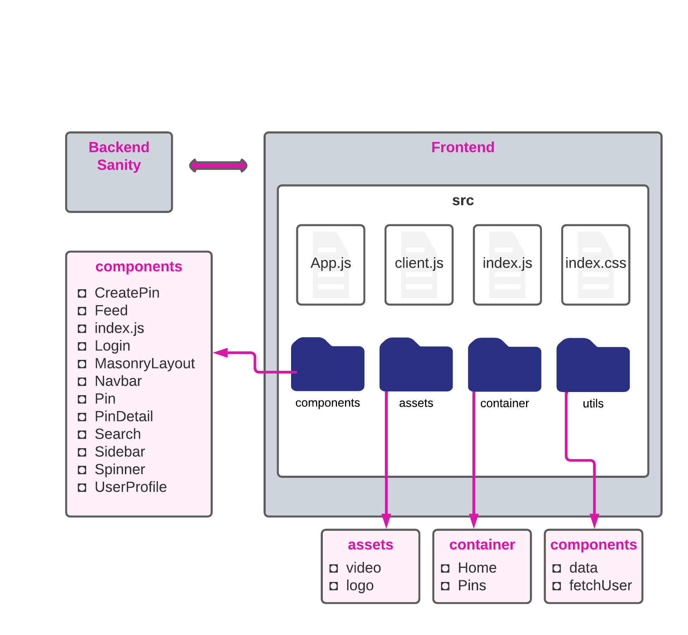
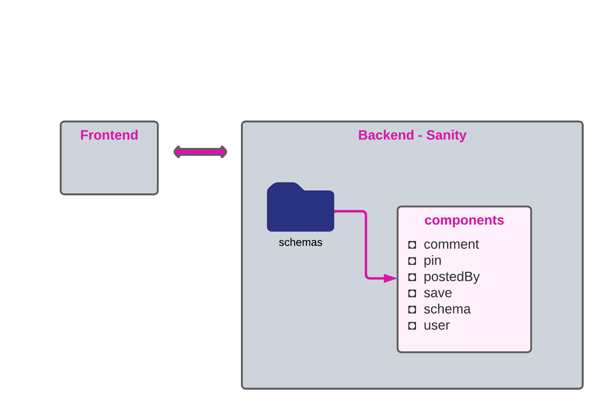
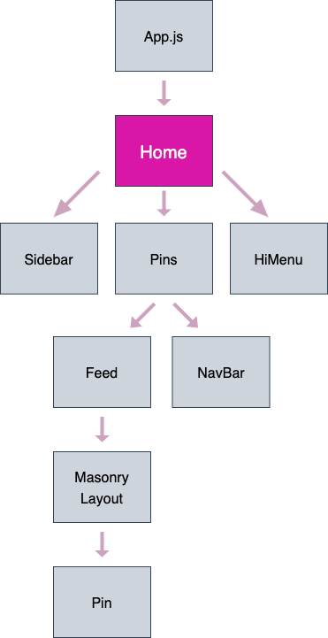

# Glimpse
A social media app for sharing images.

#### By Karen Axon

#### **https://glimpse-app.netlify.app**





## Data Flow Diagram




## Technologies Used
* Javascript
* React
* Sanity
* Tailwind


## Setup/Installation 

* Click on the [repository's](https://github.com/karenaxon/glimpse.git) link.
* Click on the green "Code" button and copy the repository URL.
* Open your terminal and navigate to the location where you would like to clone the application.
* Use the command _git clone https://github.com/karenaxon/glimpse.git_ to clone the repository.
* Get a Google Authentication API token by going to https://developers.google.com/identity/sign-in/web/sign-in.
* Create a new Sanity project by going to https://www.sanity.io/docs/getting-started-with-sanity-cli.
* In the root directory of the application set up a .env file and add the following:
  ```
  REACT_APP_GOOGLE_API_TOKEN = YourToken
  REACT_APP_SANITY_PROJECT_ID = YourProjectID
  REACT_APP_SANITY_TOKEN =  YourSanityToken
  ```

* From the frontend directory run 
    - _npm install_
    -  _npm run start_
* Navigate to ``` localhost:3000 ``` in your favorite web browser to view the project.


## Known Bugs
* The image of the logged in Google user isn't always displayed.
* In a mobil device, the video in the background of the login page starts playing outside of the login page and the user has to hit "back" in order to see the login page once more. 


## License

[MIT](https://choosealicense.com/licenses/mit/)

Copyright (c) March 2022 - Karen Axon


## Contact Information:

<h3>Karen Axon</h3>

[](https://github.com/karenaxon)
[](https://www.linkedin.com/in/kaxon)
